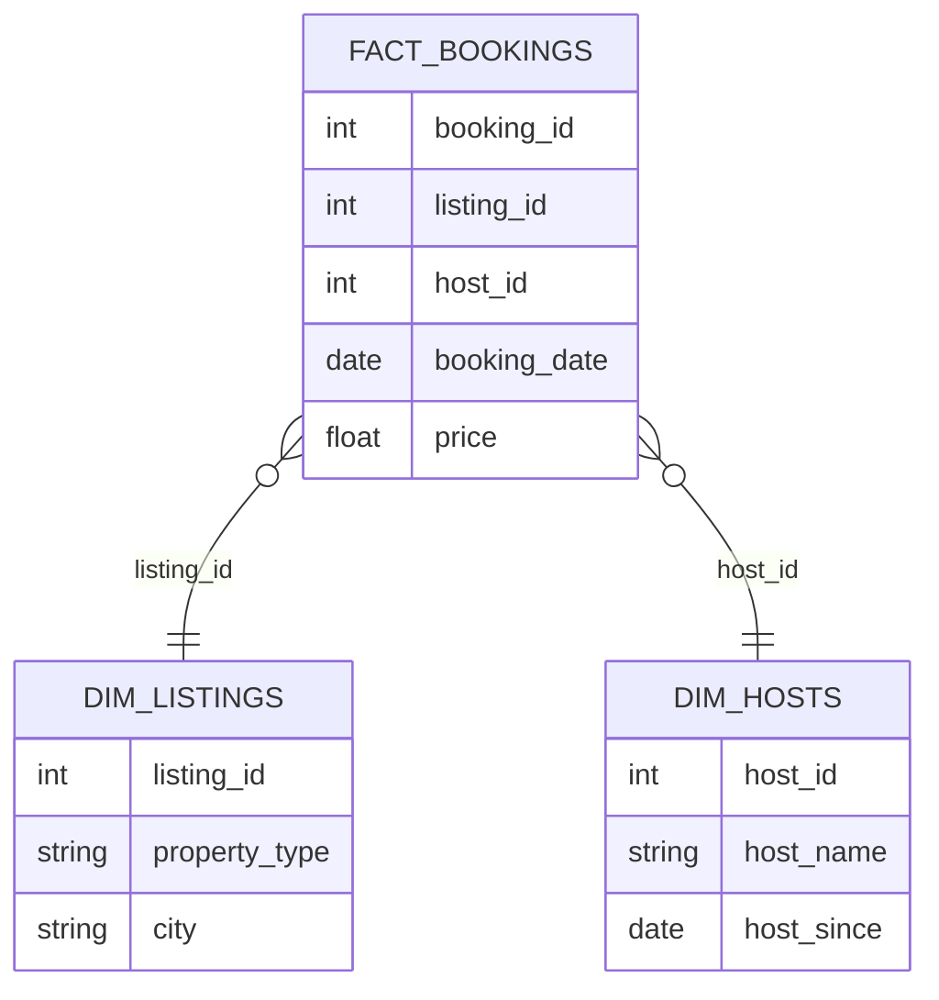

# Airbnb Modern Data Pipeline

# Project Overview

This project demonstrates the design and implementation of a **modern cloud data pipeline** for Airbnb data using a scalable **ELT architecture**.

The pipeline automatically ingests raw data, processes transformations, tracks historical changes, delivers **analytics-ready datasets** for business intelligence
and **Automated dbt documentation generation providing model lineage and dataset documentation**.

The project showcases **industry best practices used in modern data platforms**, including:

* cloud data warehousing

* layered data modeling

* incremental data processing

* event-driven orchestration

* automated CI/CD for data pipelines

* historical data tracking with SCD Type 2
* dbt docs provides a lightweight analytics documentation layer.

## 📚 dbt Documentation

The dbt documentation for this project is automatically generated and published with GitHub Actions.

🔗 View the documentation here:  
https://malek-dataeng.github.io/Airbnb_proj_Stach_AWS_Snowflake_DBT/

---

# Architecture Overview

The pipeline integrates **Amazon S3, Snowflake and dbt** to build a scalable ELT architecture.

## Architecture Diagram


<svg xmlns="http://www.w3.org/2000/svg" viewBox="0 0 900 1520" width="900" height="1520" font-family="'Courier New', monospace">
  <defs>
    <linearGradient id="bg" x1="0%" y1="0%" x2="100%" y2="100%">
      <stop offset="0%" style="stop-color:#020817"/>
      <stop offset="50%" style="stop-color:#0D1B2E"/>
      <stop offset="100%" style="stop-color:#020817"/>
    </linearGradient>
    <filter id="glow-gold" x="-50%" y="-50%" width="200%" height="200%">
      <feGaussianBlur stdDeviation="4" result="coloredBlur"/>
      <feMerge><feMergeNode in="coloredBlur"/><feMergeNode in="SourceGraphic"/></feMerge>
    </filter>
    <filter id="shadow" x="-20%" y="-20%" width="140%" height="140%">
      <feDropShadow dx="0" dy="4" stdDeviation="8" flood-color="rgba(0,0,0,0.5)"/>
    </filter>
    <pattern id="grid" width="40" height="40" patternUnits="userSpaceOnUse">
      <path d="M 40 0 L 0 0 0 40" fill="none" stroke="rgba(41,181,232,0.04)" stroke-width="1"/>
    </pattern>
    <radialGradient id="orb1" cx="50%" cy="50%" r="50%">
      <stop offset="0%" style="stop-color:#29B5E8;stop-opacity:0.06"/>
      <stop offset="100%" style="stop-color:#29B5E8;stop-opacity:0"/>
    </radialGradient>
    <radialGradient id="orb2" cx="50%" cy="50%" r="50%">
      <stop offset="0%" style="stop-color:#FBBF24;stop-opacity:0.05"/>
      <stop offset="100%" style="stop-color:#FBBF24;stop-opacity:0"/>
    </radialGradient>
    <marker id="arr-orange" markerWidth="8" markerHeight="6" refX="8" refY="3" orient="auto">
      <polygon points="0 0, 8 3, 0 6" fill="#FF9900" opacity="0.8"/>
    </marker>
    <marker id="arr-purple" markerWidth="8" markerHeight="6" refX="8" refY="3" orient="auto">
      <polygon points="0 0, 8 3, 0 6" fill="#A78BFA" opacity="0.8"/>
    </marker>
    <marker id="arr-red" markerWidth="8" markerHeight="6" refX="8" refY="3" orient="auto">
      <polygon points="0 0, 8 3, 0 6" fill="#FF694A" opacity="0.8"/>
    </marker>
  </defs>

  <!-- Background -->
  <rect width="900" height="1520" fill="url(#bg)"/>
  <rect width="900" height="1520" fill="url(#grid)"/>
  <ellipse cx="150" cy="300" rx="300" ry="300" fill="url(#orb1)"/>
  <ellipse cx="750" cy="1200" rx="300" ry="300" fill="url(#orb2)"/>

  <!-- ===== TITLE ===== -->
  <text x="450" y="42" text-anchor="middle" fill="#29B5E8" font-size="10" letter-spacing="4" opacity="0.7">DATA ENGINEERING PIPELINE</text>
  <text x="450" y="72" text-anchor="middle" font-size="24" font-weight="700" fill="#E2E8F0" letter-spacing="1">Modern Data Pipeline</text>
  <text x="450" y="92" text-anchor="middle" fill="#334155" font-size="11">AWS S3 + Snowflake + dbt + Gold Analytics</text>
  <line x1="220" y1="104" x2="680" y2="104" stroke="#1E293B" stroke-width="1"/>

  <!-- ===== LAYER BADGE: INGESTION ===== -->
  <rect x="370" y="116" width="160" height="20" rx="10" fill="rgba(255,153,0,0.08)" stroke="rgba(255,153,0,0.3)" stroke-width="1"/>
  <circle cx="386" cy="126" r="4" fill="#FF9900"/>
  <text x="450" y="130" text-anchor="middle" fill="#FF9900" font-size="9" letter-spacing="2" font-weight="700">INGESTION</text>

  <!-- ===== NODE A: AWS S3 ===== -->
  <rect x="300" y="144" width="300" height="64" rx="12" fill="rgba(255,153,0,0.08)" stroke="rgba(255,153,0,0.35)" stroke-width="1.5" filter="url(#shadow)"/>
  <polygon points="328,176 344,163 344,189" fill="none" stroke="#FF9900" stroke-width="1.5" opacity="0.4"/>
  <polygon points="328,176 312,163 312,189" fill="none" stroke="#FF9900" stroke-width="1.5" opacity="0.4"/>
  <ellipse cx="328" cy="176" rx="16" ry="6" fill="rgba(255,153,0,0.2)" stroke="#FF9900" stroke-width="1.5"/>
  <rect x="312" y="170" width="32" height="12" fill="rgba(255,153,0,0.15)" stroke="none"/>
  <text x="356" y="169" fill="#FF9900" font-size="13" font-weight="700" letter-spacing="0.5">AWS S3</text>
  <text x="356" y="186" fill="#64748B" font-size="11">Raw Files Storage</text>
  <rect x="536" y="155" width="52" height="16" rx="8" fill="rgba(255,153,0,0.15)" stroke="rgba(255,153,0,0.4)" stroke-width="1"/>
  <text x="562" y="167" text-anchor="middle" fill="#FF9900" font-size="9">SOURCE</text>

  <!-- ~~~ ANNOTATION: IAM + Role (right of S3) ~~~ -->
  <line x1="600" y1="176" x2="648" y2="176" stroke="#FF9900" stroke-width="1" stroke-dasharray="4,3" opacity="0.6" marker-end="url(#arr-orange)"/>
  <rect x="652" y="152" width="200" height="48" rx="8" fill="rgba(255,153,0,0.06)" stroke="rgba(255,153,0,0.4)" stroke-width="1.5"/>
  <!-- shield icon -->
  <path d="M663 162 L663 178 Q663 184 669 186 Q675 184 675 178 L675 162 L669 160 Z" fill="rgba(255,153,0,0.25)" stroke="#FF9900" stroke-width="1.2"/>
  <line x1="666" y1="168" x2="672" y2="168" stroke="#FF9900" stroke-width="1" opacity="0.7"/>
  <line x1="666" y1="172" x2="672" y2="172" stroke="#FF9900" stroke-width="1" opacity="0.5"/>
  <text x="681" y="165" fill="#FF9900" font-size="10" font-weight="700">IAM + Role</text>
  <text x="681" y="178" fill="#94A3B8" font-size="9">Storage Integration</text>
  <text x="681" y="190" fill="#64748B" font-size="9">+ Trust Policy</text>

  <!-- Arrow A to B -->
  <line x1="450" y1="208" x2="450" y2="258" stroke="#FF9900" stroke-width="1.5" opacity="0.6"/>
  <polygon points="450,266 444,254 456,254" fill="#FF9900" opacity="0.8"/>

  <!-- ~~~ ANNOTATION: S3 Event Notification SQS (left of arrow A-B) ~~~ -->
  <line x1="432" y1="232" x2="370" y2="232" stroke="#A78BFA" stroke-width="1" stroke-dasharray="4,3" opacity="0.7" marker-end="url(#arr-purple)"/>
  <rect x="80" y="210" width="286" height="48" rx="8" fill="rgba(167,139,250,0.06)" stroke="rgba(167,139,250,0.4)" stroke-width="1.5"/>
  <!-- SQS queue icon -->
  <rect x="90" y="222" width="22" height="16" rx="3" fill="rgba(167,139,250,0.2)" stroke="#A78BFA" stroke-width="1.2"/>
  <line x1="94" y1="227" x2="108" y2="227" stroke="#A78BFA" stroke-width="1"/>
  <line x1="94" y1="231" x2="108" y2="231" stroke="#A78BFA" stroke-width="1" opacity="0.5"/>
  <line x1="94" y1="235" x2="104" y2="235" stroke="#A78BFA" stroke-width="1" opacity="0.3"/>
  <text x="118" y="223" fill="#A78BFA" font-size="10" font-weight="700">S3 Event Notification</text>
  <text x="118" y="235" fill="#94A3B8" font-size="9">SQS Queue trigger</text>
  <text x="118" y="247" fill="#64748B" font-size="9">Notifies Snowpipe on new file</text>

  <!-- ===== NODE B: SNOWPIPE ===== -->
  <rect x="300" y="274" width="300" height="64" rx="12" fill="rgba(41,181,232,0.08)" stroke="rgba(41,181,232,0.35)" stroke-width="1.5" filter="url(#shadow)"/>
  <rect x="312" y="294" width="36" height="24" rx="12" fill="rgba(41,181,232,0.2)" stroke="#29B5E8" stroke-width="1.5"/>
  <circle cx="321" cy="306" r="3" fill="#29B5E8"/>
  <circle cx="330" cy="306" r="3" fill="#29B5E8"/>
  <circle cx="339" cy="306" r="3" fill="#29B5E8"/>
  <text x="360" y="299" fill="#29B5E8" font-size="13" font-weight="700" letter-spacing="0.5">Snowpipe</text>
  <text x="360" y="316" fill="#64748B" font-size="11">Auto Ingestion</text>
  <rect x="536" y="285" width="52" height="16" rx="8" fill="rgba(41,181,232,0.15)" stroke="rgba(41,181,232,0.4)" stroke-width="1"/>
  <text x="562" y="297" text-anchor="middle" fill="#29B5E8" font-size="9">STREAM</text>

  <!-- Arrow B to C -->
  <line x1="450" y1="338" x2="450" y2="362" stroke="#29B5E8" stroke-width="1.5" opacity="0.6"/>
  <polygon points="450,370 444,358 456,358" fill="#29B5E8" opacity="0.8"/>

  <!-- LAYER BADGE: BRONZE -->
  <rect x="360" y="376" width="180" height="20" rx="10" fill="rgba(205,127,50,0.08)" stroke="rgba(205,127,50,0.3)" stroke-width="1"/>
  <circle cx="378" cy="386" r="4" fill="#CD7F32"/>
  <text x="450" y="390" text-anchor="middle" fill="#CD7F32" font-size="9" letter-spacing="2" font-weight="700">BRONZE LAYER</text>

  <!-- NODE C: SNOWFLAKE STAGING -->
  <rect x="300" y="404" width="300" height="64" rx="12" fill="rgba(41,181,232,0.08)" stroke="rgba(41,181,232,0.35)" stroke-width="1.5" filter="url(#shadow)"/>
  <line x1="328" y1="418" x2="328" y2="454" stroke="#29B5E8" stroke-width="2"/>
  <line x1="312" y1="436" x2="344" y2="436" stroke="#29B5E8" stroke-width="2"/>
  <line x1="315" y1="421" x2="341" y2="451" stroke="#29B5E8" stroke-width="2"/>
  <line x1="341" y1="421" x2="315" y2="451" stroke="#29B5E8" stroke-width="2"/>
  <circle cx="328" cy="436" r="4" fill="#29B5E8"/>
  <circle cx="328" cy="419" r="2" fill="#29B5E8" opacity="0.7"/>
  <circle cx="328" cy="453" r="2" fill="#29B5E8" opacity="0.7"/>
  <circle cx="312" cy="436" r="2" fill="#29B5E8" opacity="0.7"/>
  <circle cx="344" cy="436" r="2" fill="#29B5E8" opacity="0.7"/>
  <text x="360" y="429" fill="#29B5E8" font-size="13" font-weight="700" letter-spacing="0.5">Snowflake</text>
  <text x="360" y="446" fill="#64748B" font-size="11">Staging Tables</text>
  <rect x="536" y="415" width="52" height="16" rx="8" fill="rgba(41,181,232,0.15)" stroke="rgba(41,181,232,0.4)" stroke-width="1"/>
  <text x="562" y="427" text-anchor="middle" fill="#29B5E8" font-size="9">STAGE</text>

  <!-- Arrow C to D -->
  <line x1="450" y1="468" x2="450" y2="492" stroke="#A78BFA" stroke-width="1.5" opacity="0.6"/>
  <polygon points="450,500 444,488 456,488" fill="#A78BFA" opacity="0.8"/>

  <!-- NODE D: STREAMS -->
  <rect x="300" y="508" width="300" height="64" rx="12" fill="rgba(167,139,250,0.08)" stroke="rgba(167,139,250,0.35)" stroke-width="1.5" filter="url(#shadow)"/>
  <path d="M312 530 Q320 522 328 530 Q336 538 344 530" stroke="#A78BFA" stroke-width="2" fill="none"/>
  <path d="M312 542 Q320 534 328 542 Q336 550 344 542" stroke="#A78BFA" stroke-width="2" fill="none" opacity="0.6"/>
  <circle cx="328" cy="540" r="4" fill="#A78BFA"/>
  <text x="360" y="533" fill="#A78BFA" font-size="13" font-weight="700" letter-spacing="0.5">Streams</text>
  <text x="360" y="550" fill="#64748B" font-size="11">Change Data Capture</text>
  <rect x="536" y="519" width="52" height="16" rx="8" fill="rgba(167,139,250,0.15)" stroke="rgba(167,139,250,0.4)" stroke-width="1"/>
  <text x="562" y="531" text-anchor="middle" fill="#A78BFA" font-size="9">CDC</text>

  <!-- Arrow D to E -->
  <line x1="450" y1="572" x2="450" y2="596" stroke="#F59E0B" stroke-width="1.5" opacity="0.6"/>
  <polygon points="450,604 444,592 456,592" fill="#F59E0B" opacity="0.8"/>

  <!-- NODE E: TASKS BRONZE -->
  <rect x="300" y="612" width="300" height="64" rx="12" fill="rgba(245,158,11,0.08)" stroke="rgba(245,158,11,0.35)" stroke-width="1.5" filter="url(#shadow)"/>
  <rect x="312" y="624" width="32" height="40" rx="3" fill="rgba(245,158,11,0.15)" stroke="#F59E0B" stroke-width="1.5"/>
  <path d="M320 640 L325 645 L335 635" stroke="#F59E0B" stroke-width="2" stroke-linecap="round" fill="none"/>
  <line x1="320" y1="653" x2="336" y2="653" stroke="#F59E0B" stroke-width="1.5" opacity="0.5"/>
  <text x="356" y="637" fill="#F59E0B" font-size="13" font-weight="700" letter-spacing="0.5">Snowflake Tasks</text>
  <text x="356" y="654" fill="#64748B" font-size="11">Bronze Layer Processing</text>
  <rect x="532" y="623" width="56" height="16" rx="8" fill="rgba(245,158,11,0.15)" stroke="rgba(245,158,11,0.4)" stroke-width="1"/>
  <text x="560" y="635" text-anchor="middle" fill="#F59E0B" font-size="9">BRONZE</text>

  <!-- Arrow E to F -->
  <line x1="450" y1="676" x2="450" y2="700" stroke="#34D399" stroke-width="1.5" opacity="0.6"/>
  <polygon points="450,708 444,696 456,696" fill="#34D399" opacity="0.8"/>

  <!-- LAYER BADGE: ORCHESTRATION -->
  <rect x="345" y="714" width="210" height="20" rx="10" fill="rgba(129,140,248,0.08)" stroke="rgba(129,140,248,0.3)" stroke-width="1"/>
  <circle cx="363" cy="724" r="4" fill="#818CF8"/>
  <text x="450" y="728" text-anchor="middle" fill="#818CF8" font-size="9" letter-spacing="2" font-weight="700">ORCHESTRATION</text>

  <!-- NODE F: CONTROL TABLE -->
  <rect x="300" y="742" width="300" height="64" rx="12" fill="rgba(52,211,153,0.08)" stroke="rgba(52,211,153,0.35)" stroke-width="1.5" filter="url(#shadow)"/>
  <line x1="314" y1="752" x2="314" y2="796" stroke="#34D399" stroke-width="2"/>
  <path d="M314 754 L338 762 L314 770" fill="rgba(52,211,153,0.25)" stroke="#34D399" stroke-width="1.5"/>
  <circle cx="314" cy="796" r="2.5" fill="#34D399"/>
  <text x="352" y="767" fill="#34D399" font-size="13" font-weight="700" letter-spacing="0.5">Control Table</text>
  <text x="352" y="784" fill="#64748B" font-size="11">RUN_DBT_FLAG</text>
  <rect x="532" y="753" width="56" height="16" rx="8" fill="rgba(52,211,153,0.15)" stroke="rgba(52,211,153,0.4)" stroke-width="1"/>
  <text x="560" y="765" text-anchor="middle" fill="#34D399" font-size="9">TRIGGER</text>

  <!-- Arrow F to G -->
  <line x1="450" y1="806" x2="450" y2="830" stroke="#E2E8F0" stroke-width="1.5" opacity="0.4"/>
  <polygon points="450,838 444,826 456,826" fill="#E2E8F0" opacity="0.6"/>

  <!-- NODE G: GITHUB ACTIONS -->
  <rect x="300" y="846" width="300" height="64" rx="12" fill="rgba(226,232,240,0.05)" stroke="rgba(226,232,240,0.2)" stroke-width="1.5" filter="url(#shadow)"/>
  <circle cx="328" cy="878" r="16" fill="rgba(226,232,240,0.1)" stroke="#E2E8F0" stroke-width="1.5"/>
  <path d="M328 864c-7.7 0-14 6.3-14 14 0 6.2 4 11.4 9.5 13.3.7.1 1-.3 1-.7v-2.4c-3.9.8-4.7-1.9-4.7-1.9-.6-1.6-1.5-2-1.5-2-1.2-.8.1-.8.1-.8 1.4.1 2.1 1.4 2.1 1.4 1.2 2.1 3.2 1.5 4 1.1.1-.9.5-1.5.9-1.8-3-.3-6.2-1.5-6.2-6.7 0-1.5.5-2.7 1.4-3.6-.1-.4-.6-1.7.1-3.6 0 0 1.1-.4 3.7 1.4 1.1-.3 2.2-.4 3.3-.4 1.1 0 2.2.1 3.3.4 2.6-1.8 3.7-1.4 3.7-1.4.7 1.9.3 3.2.1 3.6.9.9 1.4 2.1 1.4 3.6 0 5.2-3.2 6.4-6.2 6.7.5.4.9 1.2.9 2.5v3.7c0 .4.3.8 1 .7 5.5-1.9 9.5-7.1 9.5-13.3 0-7.7-6.3-14-14-14z" fill="#E2E8F0"/>
  <text x="360" y="871" fill="#E2E8F0" font-size="13" font-weight="700" letter-spacing="0.5">GitHub Actions</text>
  <text x="360" y="888" fill="#64748B" font-size="11">CI/CD Workflow</text>
  <rect x="532" y="857" width="56" height="16" rx="8" fill="rgba(226,232,240,0.1)" stroke="rgba(226,232,240,0.3)" stroke-width="1"/>
  <text x="560" y="869" text-anchor="middle" fill="#E2E8F0" font-size="9">CI/CD</text>

  <!-- Arrow G to H -->
  <line x1="450" y1="910" x2="450" y2="934" stroke="#FF694A" stroke-width="1.5" opacity="0.6"/>
  <polygon points="450,942 444,930 456,930" fill="#FF694A" opacity="0.8"/>

  <!-- LAYER BADGE: SILVER -->
  <rect x="365" y="948" width="170" height="20" rx="10" fill="rgba(148,163,184,0.08)" stroke="rgba(148,163,184,0.3)" stroke-width="1"/>
  <circle cx="383" cy="958" r="4" fill="#94A3B8"/>
  <text x="450" y="962" text-anchor="middle" fill="#94A3B8" font-size="9" letter-spacing="2" font-weight="700">SILVER LAYER</text>

  <!-- NODE H: DBT -->
  <rect x="300" y="976" width="300" height="64" rx="12" fill="rgba(255,105,74,0.08)" stroke="rgba(255,105,74,0.35)" stroke-width="1.5" filter="url(#shadow)"/>
  <path d="M328 992 L344 1008 L328 1024 L312 1008 Z" fill="rgba(255,105,74,0.2)" stroke="#FF694A" stroke-width="1.5"/>
  <path d="M320 1000 L328 992 L336 1000 L328 1008 Z" fill="rgba(255,105,74,0.4)"/>
  <circle cx="328" cy="1008" r="3" fill="#FF694A"/>
  <text x="360" y="1001" fill="#FF694A" font-size="13" font-weight="700" letter-spacing="0.5">dbt</text>
  <text x="360" y="1018" fill="#64748B" font-size="11">Transformations + Tests</text>
  <rect x="536" y="987" width="52" height="16" rx="8" fill="rgba(255,105,74,0.15)" stroke="rgba(255,105,74,0.4)" stroke-width="1"/>
  <text x="562" y="999" text-anchor="middle" fill="#FF694A" font-size="9">TRANSFORM</text>

  <!-- ~~~ ANNOTATION: dbt docs (right of dbt node) ~~~ -->
  <line x1="600" y1="1008" x2="648" y2="1008" stroke="#FF694A" stroke-width="1" stroke-dasharray="4,3" opacity="0.6" marker-end="url(#arr-red)"/>
  <rect x="652" y="985" width="200" height="48" rx="8" fill="rgba(255,105,74,0.06)" stroke="rgba(255,105,74,0.4)" stroke-width="1.5"/>
  <!-- doc page icon -->
  <rect x="662" y="993" width="16" height="20" rx="2" fill="rgba(255,105,74,0.2)" stroke="#FF694A" stroke-width="1.2"/>
  <path d="M666 993 L666 989 L674 989 L678 993" fill="rgba(255,105,74,0.3)" stroke="#FF694A" stroke-width="1"/>
  <line x1="665" y1="999" x2="675" y2="999" stroke="#FF694A" stroke-width="1" opacity="0.7"/>
  <line x1="665" y1="1003" x2="675" y2="1003" stroke="#FF694A" stroke-width="1" opacity="0.5"/>
  <line x1="665" y1="1007" x2="675" y2="1007" stroke="#FF694A" stroke-width="1" opacity="0.3"/>
  <text x="685" y="998" fill="#FF694A" font-size="10" font-weight="700">dbt docs</text>
  <text x="685" y="1010" fill="#94A3B8" font-size="9">Auto-generated lineage</text>
  <text x="685" y="1022" fill="#64748B" font-size="9">+ data catalog</text>

  <!-- dbt splits into I and J -->
  <line x1="380" y1="1040" x2="240" y2="1070" stroke="#94A3B8" stroke-width="1.5" opacity="0.6"/>
  <polygon points="232,1084 230,1068 244,1072" fill="#94A3B8" opacity="0.8"/>
  <line x1="520" y1="1040" x2="660" y2="1070" stroke="#818CF8" stroke-width="1.5" opacity="0.6"/>
  <polygon points="668,1084 656,1072 670,1068" fill="#818CF8" opacity="0.8"/>

  <!-- NODE I: SILVER TABLES left -->
  <rect x="110" y="1092" width="240" height="64" rx="12" fill="rgba(148,163,184,0.08)" stroke="rgba(148,163,184,0.35)" stroke-width="1.5" filter="url(#shadow)"/>
  <ellipse cx="148" cy="1112" rx="14" ry="5" fill="rgba(148,163,184,0.2)" stroke="#94A3B8" stroke-width="1.5"/>
  <rect x="134" y="1112" width="28" height="18" fill="rgba(148,163,184,0.1)"/>
  <line x1="134" y1="1112" x2="134" y2="1130" stroke="#94A3B8" stroke-width="1.5"/>
  <line x1="162" y1="1112" x2="162" y2="1130" stroke="#94A3B8" stroke-width="1.5"/>
  <ellipse cx="148" cy="1130" rx="14" ry="5" fill="rgba(148,163,184,0.2)" stroke="#94A3B8" stroke-width="1.5"/>
  <ellipse cx="148" cy="1120" rx="14" ry="5" fill="none" stroke="#94A3B8" stroke-width="1" opacity="0.4"/>
  <text x="176" y="1115" fill="#94A3B8" font-size="12" font-weight="700">Silver Tables</text>
  <text x="176" y="1131" fill="#64748B" font-size="10">Clean Data</text>

  <!-- NODE J: SNAPSHOTS SCD2 right -->
  <rect x="550" y="1092" width="240" height="64" rx="12" fill="rgba(129,140,248,0.08)" stroke="rgba(129,140,248,0.35)" stroke-width="1.5" filter="url(#shadow)"/>
  <rect x="562" y="1104" width="24" height="18" rx="2" fill="rgba(129,140,248,0.2)" stroke="#818CF8" stroke-width="1.5"/>
  <rect x="570" y="1114" width="24" height="18" rx="2" fill="rgba(129,140,248,0.35)" stroke="#818CF8" stroke-width="1.5"/>
  <line x1="574" y1="1110" x2="578" y2="1114" stroke="#818CF8" stroke-width="1.5"/>
  <text x="602" y="1115" fill="#818CF8" font-size="12" font-weight="700">Snapshots</text>
  <text x="602" y="1131" fill="#64748B" font-size="10">SCD Type 2</text>

  <!-- I and J merge into K -->
  <line x1="230" y1="1156" x2="380" y2="1192" stroke="#F472B6" stroke-width="1.5" opacity="0.6"/>
  <line x1="670" y1="1156" x2="520" y2="1192" stroke="#F472B6" stroke-width="1.5" opacity="0.6"/>
  <polygon points="450,1208 442,1192 458,1192" fill="#F472B6" opacity="0.8"/>

  <!-- NODE K: FACT BOOKINGS -->
  <rect x="300" y="1216" width="300" height="64" rx="12" fill="rgba(244,114,182,0.08)" stroke="rgba(244,114,182,0.35)" stroke-width="1.5" filter="url(#shadow)"/>
  <rect x="312" y="1228" width="32" height="40" rx="3" fill="rgba(244,114,182,0.12)" stroke="#F472B6" stroke-width="1.5"/>
  <line x1="312" y1="1238" x2="344" y2="1238" stroke="#F472B6" stroke-width="1" opacity="0.5"/>
  <line x1="312" y1="1248" x2="344" y2="1248" stroke="#F472B6" stroke-width="1" opacity="0.5"/>
  <line x1="312" y1="1258" x2="344" y2="1258" stroke="#F472B6" stroke-width="1" opacity="0.5"/>
  <line x1="324" y1="1228" x2="324" y2="1268" stroke="#F472B6" stroke-width="1" opacity="0.5"/>
  <circle cx="328" cy="1248" r="5" fill="#F472B6" opacity="0.5"/>
  <circle cx="328" cy="1248" r="2.5" fill="#F472B6"/>
  <text x="360" y="1241" fill="#F472B6" font-size="13" font-weight="700" letter-spacing="0.5">Fact Bookings</text>
  <text x="360" y="1258" fill="#64748B" font-size="11">Core Business Facts</text>
  <rect x="536" y="1227" width="52" height="16" rx="8" fill="rgba(244,114,182,0.15)" stroke="rgba(244,114,182,0.4)" stroke-width="1"/>
  <text x="562" y="1239" text-anchor="middle" fill="#F472B6" font-size="9">FACTS</text>

  <!-- Arrow K to L -->
  <line x1="450" y1="1280" x2="450" y2="1308" stroke="#FBBF24" stroke-width="2" opacity="0.8"/>
  <polygon points="450,1316 443,1304 457,1304" fill="#FBBF24"/>

  <!-- LAYER BADGE: GOLD -->
  <rect x="375" y="1322" width="150" height="20" rx="10" fill="rgba(251,191,36,0.1)" stroke="rgba(251,191,36,0.4)" stroke-width="1"/>
  <circle cx="393" cy="1332" r="4" fill="#FBBF24"/>
  <text x="450" y="1336" text-anchor="middle" fill="#FBBF24" font-size="9" letter-spacing="2" font-weight="700">GOLD LAYER</text>

  <!-- NODE L: GOLD ANALYTICS -->
  <rect x="270" y="1350" width="360" height="52" rx="12" fill="rgba(251,191,36,0.1)" stroke="rgba(251,191,36,0.5)" stroke-width="2" filter="url(#glow-gold)"/>
  <polygon points="305,1376 308,1366 311,1376 321,1376 313,1382 316,1392 308,1386 300,1392 303,1382 295,1376" fill="#FBBF24" opacity="0.8"/>
  <text x="336" y="1372" fill="#FBBF24" font-size="14" font-weight="700" letter-spacing="0.5">Gold Analytics Tables</text>
  <text x="336" y="1389" fill="#94A3B8" font-size="11">Final Reporting Layer</text>
  <rect x="563" y="1360" width="53" height="16" rx="8" fill="rgba(251,191,36,0.2)" stroke="rgba(251,191,36,0.5)" stroke-width="1"/>
  <text x="589" y="1372" text-anchor="middle" fill="#FBBF24" font-size="9">ANALYTICS</text>

  <!-- Bottom legend bar -->
  <line x1="40" y1="1418" x2="860" y2="1418" stroke="#1E293B" stroke-width="1"/>
  <text x="450" y="1438" text-anchor="middle" fill="#334155" font-size="9" letter-spacing="3">LEGEND</text>

  <!-- Legend items -->
  <line x1="60" y1="1455" x2="86" y2="1455" stroke="#FF9900" stroke-width="1" stroke-dasharray="4,3" opacity="0.7"/>
  <polygon points="86,1452 94,1455 86,1458" fill="#FF9900" opacity="0.7"/>
  <text x="100" y="1459" fill="#FF9900" font-size="9" font-weight="700">IAM + Role</text>
  <text x="100" y="1471" fill="#475569" font-size="8">Storage integration + trust policy</text>

  <line x1="310" y1="1455" x2="336" y2="1455" stroke="#A78BFA" stroke-width="1" stroke-dasharray="4,3" opacity="0.7"/>
  <polygon points="336,1452 344,1455 336,1458" fill="#A78BFA" opacity="0.7"/>
  <text x="350" y="1459" fill="#A78BFA" font-size="9" font-weight="700">S3 Event Notif. (SQS)</text>
  <text x="350" y="1471" fill="#475569" font-size="8">Triggers Snowpipe on file upload</text>

  <line x1="590" y1="1455" x2="616" y2="1455" stroke="#FF694A" stroke-width="1" stroke-dasharray="4,3" opacity="0.7"/>
  <polygon points="616,1452 624,1455 616,1458" fill="#FF694A" opacity="0.7"/>
  <text x="630" y="1459" fill="#FF694A" font-size="9" font-weight="700">dbt docs</text>
  <text x="630" y="1471" fill="#475569" font-size="8">Auto lineage + data catalog</text>

  <line x1="40" y1="1508" x2="860" y2="1508" stroke="#0F172A" stroke-width="1"/>
</svg>


# Data Modeling

The transformation layer implements a **dimensional star schema optimized for analytics workloads**.

**Core Tables**

* Fact Table

    * fact_bookings

* Dimension Tables

    * dim_listings

    * dim_hosts

## Star Schema



---

# Data Pipeline Flow

```
S3 → Snowpipe → Staging → Streams → Tasks → Bronze
      ↓
Control Table (RUN_DBT_FLAG)
      ↓
GitHub Actions
      ↓
dbt build
      ↓
Silver → Snapshots (dim) → Fact → Gold
```

---

# dbt Transformation Layers

The dbt project follows a structured modeling approach.

```
staging
   ↓
bronze
   ↓
silver
   ↓
snapshots (SCD Type 2)
   ↓
fact tables
   ↓
gold analytics tables
```

### Staging

Raw ingested tables from Snowflake staging.

### Bronze

Incremental ingestion and deduplication layer.

### Silver

Clean, business-ready datasets.

### Snapshots

Historical tracking using **Slowly Changing Dimensions (Type 2)**.

### Fact Tables

Transactional data representing booking events.

### Gold Layer

Analytics-ready datasets optimized for BI queries.

---

# CI/CD for Data Pipelines

The project includes automated **data pipeline CI/CD using GitHub Actions**.

## Continuous Integration (CI)

Triggered on:

* pull requests
* commits to main branch

CI pipeline executes:

```
dbt deps
dbt debug
dbt run
dbt test
dbt docs generate
Publish dbt docs to GitHub Pages
```

Ensuring:

* SQL model validation
* data quality testing
* Snowflake connectivity

---

## Continuous Deployment (CD)

A scheduled workflow checks the pipeline control table.

If new data is detected:

```
dbt build
```

is automatically triggered.

This enables **event-driven data transformations**.

---

# Project Structure

```
airbnb-data-pipeline
│
├── models
│   ├── bronze
│   ├── silver
│   └── gold
│         ├──ephemeral
│         ├──fact
│         ├──marts
│
├── snapshots
│
├── scripts
│   └── run_dbt_if_needed.py
│
├── .github
│   └── workflows
│       ├── dbt_ci.yml
│       └── run_dbt_pipeline.yml
│
└── dbt_project.yml
```

---

# Technologies

| Layer          | Technology                |
| -------------- | ------------------------- |
| Storage        | AWS S3                    |
| Data Warehouse | Snowflake                 |
| Transformation | dbt                       |
| Orchestration  | Snowflake Streams & Tasks |
| CI/CD          | GitHub Actions            |
| Programming    | Python                    |


---

# Key Data Engineering Concepts Demonstrated

* Modern ELT architecture

* Layered data modeling (Bronze / Silver / Gold)

* Incremental data processing

* Event-driven pipelines

* Slowly Changing Dimensions (SCD Type 2)

* Automated data testing

* CI/CD for data pipelines

* Cloud-native data platform design

---

# Future Improvements

Potential extensions:

* data observability (Monte Carlo / Great Expectations)

* data freshness monitoring

* BI dashboards (Power BI / Looker)

* semantic layer

* orchestration with Apache Airflow

---

# Author

Modern Data Engineering portfolio project showcasing **scalable cloud data platform architecture**.
