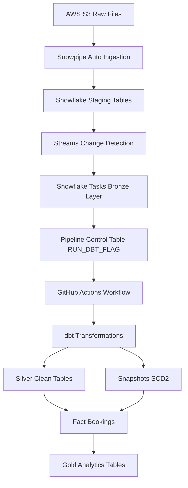
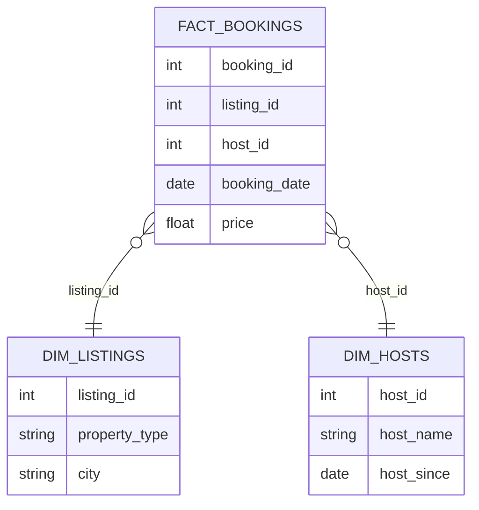

# Airbnb Modern Data Pipeline

# Overview

This project implements a **modern end-to-end data pipeline** for Airbnb datasets using a cloud data warehouse architecture.

The pipeline automatically:

* ingests raw data
* processes transformations
* tracks historical changes
* produces analytics-ready tables

The architecture follows **modern Data Engineering best practices** such as:

* layered data architecture
* event-driven pipelines
* incremental transformations
* CI/CD for data workflows
* automated orchestration

---

# Data Architecture

The pipeline integrates **Amazon S3, Snowflake and dbt** to build a scalable ELT architecture.

## Architecture Diagram



---

# Data Modeling

The transformation layer implements a **dimensional model** optimized for analytics.

## Star Schema



---

# Data Pipeline Flow

```
S3 → Snowpipe → Staging → Streams → Tasks → Bronze
      ↓
Control Table (RUN_DBT_FLAG)
      ↓
GitHub Actions
      ↓
dbt build
      ↓
Silver → Snapshots (dim) → Fact → Gold
```

---

# dbt Transformation Layers

The dbt project follows a structured modeling approach.

```
staging
   ↓
bronze
   ↓
silver
   ↓
snapshots (SCD Type 2)
   ↓
fact tables
   ↓
gold analytics tables
```

### Staging

Raw tables.

### Bronze

Raw tables incremented and dedeupliqued data.

### Silver

Business-ready clean datasets.

### Snapshots

Track historical changes using **Slowly Changing Dimensions (Type 2)**.

### Fact Tables

Store measurable business events such as bookings.

### Gold Layer

Optimized datasets for BI and analytics.

---

# CI/CD Pipeline

This project implements **Continuous Integration and Continuous Deployment**.

## CI (Continuous Integration)

Triggered on:

* pull requests
* commits to main branch

CI runs:

```
dbt deps
dbt debug
dbt test
```

Purpose:

* validate SQL models
* ensure data quality
* verify connectivity

---

## CD (Continuous Deployment)

A scheduled workflow checks the pipeline control table.

If new data is detected:

```
dbt build
```

is executed automatically.

---

# Project Structure

```
airbnb-data-pipeline
│
├── models
│   ├── bronze
│   ├── silver
│   └── gold
│         ├──ephemeral
│         ├──fact
│         ├──marts
│
├── snapshots
│
├── scripts
│   └── run_dbt_if_needed.py
│
├── .github
│   └── workflows
│       ├── dbt_ci.yml
│       └── run_dbt_pipeline.yml
│
└── dbt_project.yml
```

---

# Technologies

Data Warehouse: Snowflake

Transformation: dbt

Orchestration: Snowflake Streams and Snowflake Tasks

CI/CD: GitHub Actions

Storage: AWS S3

Programming: Python

---

# Key Features

Event-driven pipeline

Incremental processing

Automated orchestration

Historical tracking (SCD2)

Data quality tests

Fully automated CI/CD

---

# Future Improvements

Potential next steps:

* data observability
* automated freshness monitoring
* BI dashboards
* semantic data layer
* orchestration with Airflow

---

# Author

Modern Data Engineering project demonstrating scalable ELT architecture.
