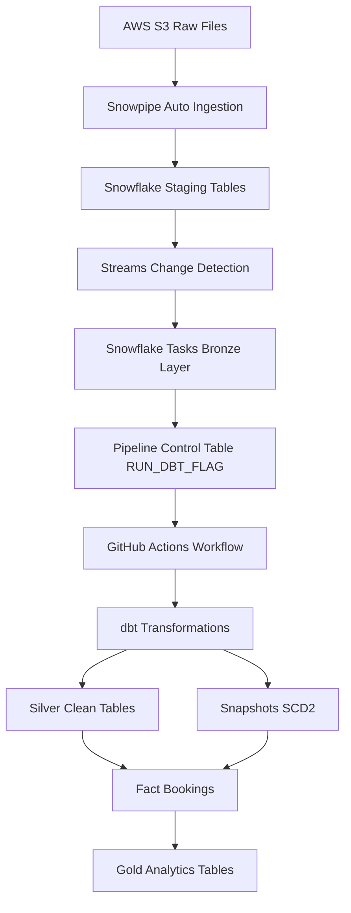
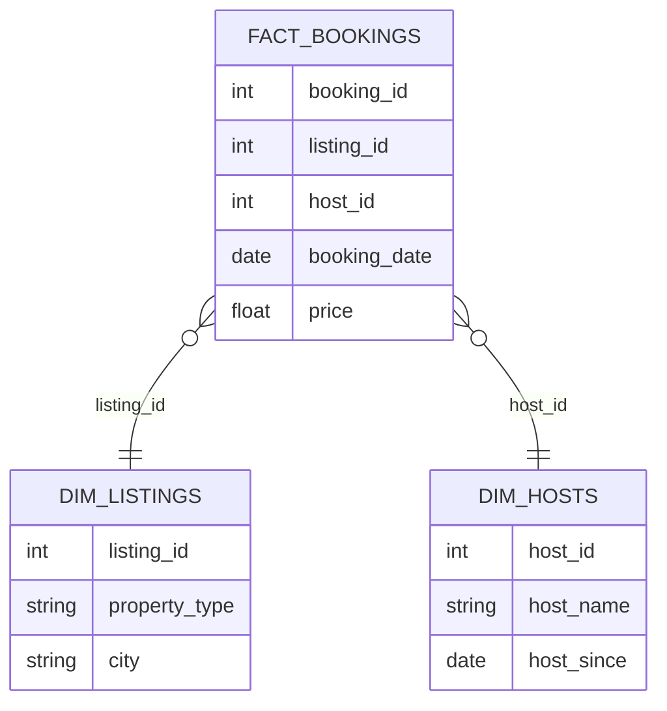

# Airbnb Modern Data Pipeline

# Project Overview

This project demonstrates the design and implementation of a **modern cloud data pipeline** for Airbnb data using a scalable **ELT architecture**.

The pipeline automatically ingests raw data, processes transformations, tracks historical changes, delivers **analytics-ready datasets** for business intelligence
and **Automated dbt documentation generation providing model lineage and dataset documentation**.

The project showcases **industry best practices used in modern data platforms**, including:

* cloud data warehousing

* layered data modeling

* incremental data processing

* event-driven orchestration

* automated CI/CD for data pipelines

* historical data tracking with SCD Type 2
* dbt docs provides a lightweight analytics documentation layer.

## 📚 dbt Documentation

The dbt documentation for this project is automatically generated and published with GitHub Actions.

🔗 View the documentation here:  
https://malek-dataeng.github.io/Airbnb_proj_Stach_AWS_Snowflake_DBT/

---

# Architecture Overview

The pipeline integrates **Amazon S3, Snowflake and dbt** to build a scalable ELT architecture.

## Architecture Diagram



---

# Data Modeling

The transformation layer implements a **dimensional star schema optimized for analytics workloads**.

**Core Tables**

* Fact Table

    * fact_bookings

* Dimension Tables

    * dim_listings

    * dim_hosts

## Star Schema



---

# Data Pipeline Flow

```
S3 → Snowpipe → Staging → Streams → Tasks → Bronze
      ↓
Control Table (RUN_DBT_FLAG)
      ↓
GitHub Actions
      ↓
dbt build
      ↓
Silver → Snapshots (dim) → Fact → Gold
```

---

# dbt Transformation Layers

The dbt project follows a structured modeling approach.

```
staging
   ↓
bronze
   ↓
silver
   ↓
snapshots (SCD Type 2)
   ↓
fact tables
   ↓
gold analytics tables
```

### Staging

Raw ingested tables from Snowflake staging.

### Bronze

Incremental ingestion and deduplication layer.

### Silver

Clean, business-ready datasets.

### Snapshots

Historical tracking using **Slowly Changing Dimensions (Type 2)**.

### Fact Tables

Transactional data representing booking events.

### Gold Layer

Analytics-ready datasets optimized for BI queries.

---

# CI/CD for Data Pipelines

The project includes automated **data pipeline CI/CD using GitHub Actions**.

## Continuous Integration (CI)

Triggered on:

* pull requests
* commits to main branch

CI pipeline executes:

```
dbt deps
dbt debug
dbt run
dbt test
dbt docs generate
Publish dbt docs to GitHub Pages
```

Ensuring:

* SQL model validation
* data quality testing
* Snowflake connectivity

---

## Continuous Deployment (CD)

A scheduled workflow checks the pipeline control table.

If new data is detected:

```
dbt build
```

is automatically triggered.

This enables **event-driven data transformations**.

---

# Project Structure

```
airbnb-data-pipeline
│
├── models
│   ├── bronze
│   ├── silver
│   └── gold
│         ├──ephemeral
│         ├──fact
│         ├──marts
│
├── snapshots
│
├── scripts
│   └── run_dbt_if_needed.py
│
├── .github
│   └── workflows
│       ├── dbt_ci.yml
│       └── run_dbt_pipeline.yml
│
└── dbt_project.yml
```

---

# Technologies

| Layer          | Technology                |
| -------------- | ------------------------- |
| Storage        | AWS S3                    |
| Data Warehouse | Snowflake                 |
| Transformation | dbt                       |
| Orchestration  | Snowflake Streams & Tasks |
| CI/CD          | GitHub Actions            |
| Programming    | Python                    |


---

# Key Data Engineering Concepts Demonstrated

* Modern ELT architecture

* Layered data modeling (Bronze / Silver / Gold)

* Incremental data processing

* Event-driven pipelines

* Slowly Changing Dimensions (SCD Type 2)

* Automated data testing

* CI/CD for data pipelines

* Cloud-native data platform design

---

# Future Improvements

Potential extensions:

* data observability (Monte Carlo / Great Expectations)

* data freshness monitoring

* BI dashboards (Power BI / Looker)

* semantic layer

* orchestration with Apache Airflow

---

# Author

Modern Data Engineering portfolio project showcasing **scalable cloud data platform architecture**.
