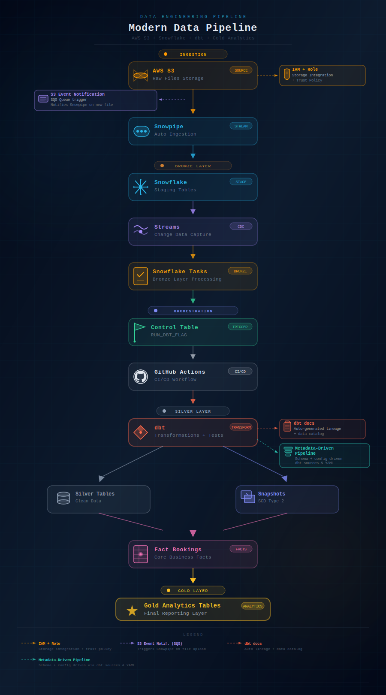
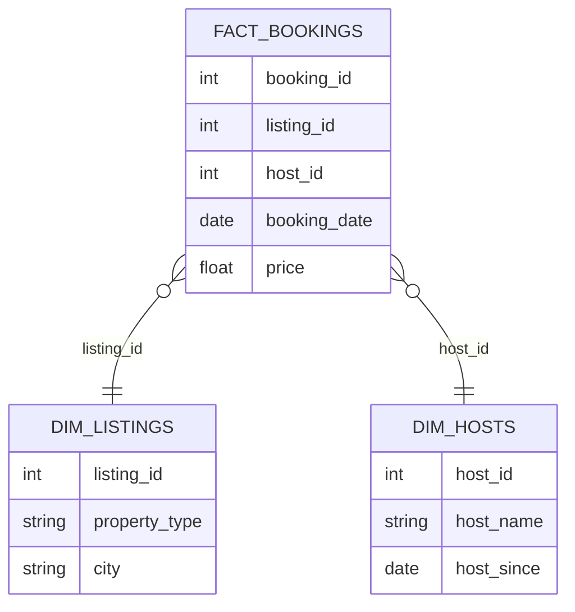

# 🏠 Airbnb Modern Data Pipeline

<div align="center">


**Production-grade ELT pipeline** — event-driven ingestion, layered data modeling, automated CI/CD and dbt documentation.

[📚 Live dbt Docs](https://malek-dataeng.github.io/Airbnb_proj_Stach_AWS_Snowflake_DBT/) · [🔗 Architecture](#architecture-overview) · [⚙️ CI/CD](#cicd-for-data-pipelines)

</div>

---

## 📌 Project Overview

This project demonstrates the **end-to-end design and implementation of a modern cloud data pipeline** for Airbnb data, built on a scalable **ELT architecture**.

The pipeline covers the full data engineering lifecycle:

| Capability | Implementation |
|---|---|
| ☁️ Cloud ingestion | AWS S3 + Snowpipe with SQS event trigger |
| 🔐 Security | IAM roles + Snowflake Storage Integration |
| 🔄 Change detection | Snowflake Streams (CDC) |
| ⚙️ Orchestration | Snowflake Tasks + Control Table flag |
| 🚀 CI/CD | GitHub Actions — automated dbt run + docs deploy |
| 🧱 Data modeling | Bronze / Silver / Gold + SCD Type 2 Snapshots |
| 📖 Documentation | Auto-generated dbt lineage + data catalog |

---

## 🏗️ Architecture Overview

The pipeline integrates **Amazon S3, Snowflake and dbt** into a fully automated, event-driven ELT architecture.



> **Key design decisions:**
> - S3 Event Notifications via SQS trigger Snowpipe automatically — no scheduler needed
> - A control table (`RUN_DBT_FLAG`) decouples ingestion from transformation, enabling event-driven dbt runs
> - SCD Type 2 Snapshots preserve full historical state of dimension tables

---

## ⚙️ dbt Transformations

### Pipeline Overview

| Layer | Model | Pattern | Business Logic |
|-------|-------|---------|----------------|
| 🥉 Bronze | `bronze_bookings` | Snowflake Task + `QUALIFY ROW_NUMBER()` | Deduplication from CDC stream — exactly-once ingestion |
| 🥉 Bronze | `bronze_listings` | Snowflake Task + `QUALIFY ROW_NUMBER()` | Deduplication on `listing_id, created_at` |
| 🥉 Bronze | `bronze_hosts` | Snowflake Task + `QUALIFY ROW_NUMBER()` | Deduplication on `host_id, created_at` |
| 🥈 Silver | `silver_bookings` | `divide()` macro | `net_revenue`, `price_per_night`, `total_booking_value` |
| 🥈 Silver | `silver_hosts` | `trim_upper()` + CASE | `host_tenure_years`, `superhost_flag`, `host_response_segment` |
| 🥈 Silver | `silver_listings` | `divide()` + `tag()` macro | `bedroom_density`, `price_per_person`, `price_tag` |
| 🥈 Silver | `dim_listings` | Snapshot SCD Type 2 | Full historical tracking of listing changes |
| 🏅 Gold | `fact_bookings` | Star schema join | Aggregated booking facts + KPIs |

---

### 📦 `silver_bookings` — Revenue Engineering

| Metric | Logic | Business Purpose |
|--------|-------|-----------------|
| `booking_price_per_night` | `booking_amount / nights_booked` | Prix normalisé par nuit |
| `total_fees` | `cleaning_fee + service_fee` | Coût total des frais |
| `total_booking_value` | `total_fees + booking_amount` | Revenue brut total |
| `net_revenue` | `booking_amount - total_fees` | Revenue net après frais |

### 🏠 `silver_hosts` — Host Performance Scoring

| Metric | Logic | Business Purpose |
|--------|-------|-----------------|
| `host_tenure_years` | `datediff(year, host_since, current_date)` | Ancienneté du host |
| `superhost_flag` | `CASE WHEN is_superhost THEN 1 ELSE 0` | Score pondéré Superhost |
| `host_response_segment` | `≥95% → ELITE / ≥80% → GOOD / else LOW` | Segmentation performance |

### 🏘️ `silver_listings` — Listing Analytics

| Metric | Logic | Business Purpose |
|--------|-------|-----------------|
| `bedroom_density` | `bedrooms / accommodates` | Confort vs capacité |
| `price_per_person` | `price_per_night / accommodates` | Prix comparatif par personne |
| `price_tag` | `{{ tag('price_per_night') }}` | BUDGET / MID_RANGE / LUXURY |

---

### 🔧 Custom Macros

| Macro | Role |
|-------|------|
| `divide(a, b, precision=2)` | Safe division with rounding |
| `multiply(a, b, precision=2)` | Multiplication with rounding |
| `tag(column)` | Price categorization: BUDGET / MID_RANGE / LUXURY |
| `trim_upper(col)` / `trim_lower(col)` | String normalization |
| `incremental(column)` | Incremental filter with first-run guard (`1=1`) |
| `generate_schema_name` | Custom schema routing — overrides dbt default |

### ✅ Data Quality Tests

| Test type | Coverage |
|-----------|----------|
| `not_null` | `booking_id`, `listing_id`, `host_id`, `booking_date`, `nights_booked` |
| `accepted_values` | `booking_status` → `confirmed`, `cancelled` |
| `relationships` | `listing_id` → `bronze_listings` · `host_id` → `bronze_hosts` |
| `dbt_utils.expression_is_true` | `nights_booked >= 1` |
| Custom singular test | Rejects bookings with `booking_amount <= 0` or `nights_booked <= 0` |

---

## 📚 dbt Documentation

Documentation is **automatically generated and published** on every push to `main` via GitHub Actions.

🔗 **[View live dbt docs →](https://malek-dataeng.github.io/Airbnb_proj_Stach_AWS_Snowflake_DBT/)**


---

## 🗂️ Data Modeling — Star Schema

The transformation layer implements a **dimensional star schema** optimized for analytics workloads.



### Modeling Layers

```
staging   →   raw tables from Snowflake staging
bronze    →   incremental ingestion + deduplication
silver    →   clean, business-ready datasets
snapshots →   historical tracking via SCD Type 2
fact      →   transactional booking events
gold      →   analytics-ready, BI-optimized tables
```

---

## 🚀 CI/CD for Data Pipelines

### Continuous Integration — triggered on PR and push to `main`

```bash
dbt deps          # install dependencies
dbt debug         # validate Snowflake connection
dbt run           # execute all models
dbt test          # run data quality tests
dbt docs generate # generate documentation
# → publish to GitHub Pages automatically
```

### Continuous Deployment — event-driven

A scheduled workflow polls the pipeline control table. When `RUN_DBT_FLAG = TRUE` (new data detected):

```bash
dbt build         # run + test all models end-to-end
```

This enables **fully automated, data-driven transformations** without manual intervention.

---

## 📁 Project Structure

```
airbnb-data-pipeline/
│
├── models/
│   ├── bronze/           # incremental ingestion
│   ├── silver/           # clean datasets
│   └── gold/
│       ├── ephemeral/    # intermediate CTEs
│       ├── fact/         # fact_bookings
│       └── marts/        # analytics marts
│
├── snapshots/            # SCD Type 2 historical tracking
│
├── scripts/
│   └── run_dbt_if_needed.py   # control table check
│
├── .github/workflows/
│   ├── dbt_ci.yml             # CI pipeline
│   └── run_dbt_pipeline.yml   # CD pipeline
│
└── dbt_project.yml
```

---

## 🛠️ Tech Stack

| Layer | Technology | Role |
|---|---|---|
| Storage | AWS S3 | Raw file landing zone |
| Ingestion | Snowpipe + SQS | Event-driven auto-load |
| Security | AWS IAM + Snowflake Role | Storage integration & trust |
| Data Warehouse | Snowflake | Staging, streams, tasks |
| Transformation | dbt | Modeling, testing, docs |
| Orchestration | Snowflake Streams & Tasks | CDC + control table flag |
| CI/CD | GitHub Actions | Automated pipeline & docs |
| Language | Python | Control table script |

---

## 💡 Key Data Engineering Concepts

- **Modern ELT architecture** — transform inside the warehouse, not before
- **Layered data modeling** — Bronze / Silver / Gold medallion architecture
- **Incremental processing** — only process new/changed records
- **Event-driven pipelines** — S3 → SQS → Snowpipe → Tasks → dbt
- **SCD Type 2** — full historical tracking of dimension changes
- **Data quality** — automated dbt tests on every run
- **CI/CD for data** — GitHub Actions treating pipelines as code
- **Cloud-native design** — serverless, scalable, zero-ops orchestration

---


## 👤 Author

**Malek** — Data Engineer

[](https://linkedin.com/in/malek-a-964758201)
[](https://github.com/malek-dataeng)
[](https://malek-dataeng.github.io/Airbnb_proj_Stach_AWS_Snowflake_DBT/)

> Portfolio project demonstrating **production-grade cloud data platform architecture** using industry best practices.
