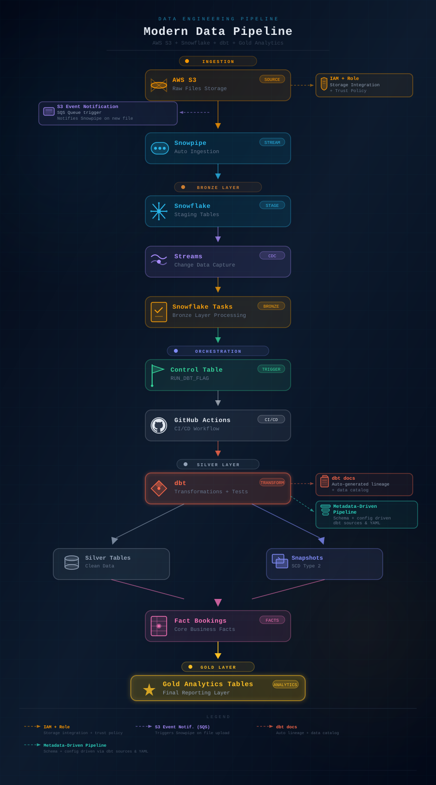
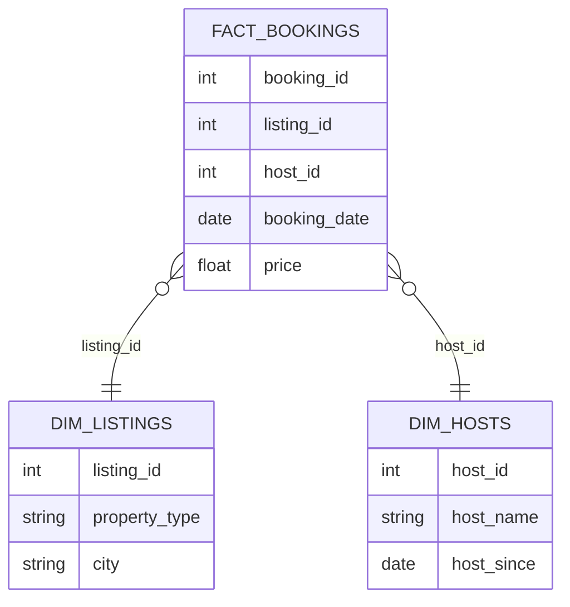

# 🏠 Airbnb Modern Data Pipeline

<div align="center">


**Reference implementation of a production-grade ELT pipeline** — event-driven ingestion, medallion modeling, automated CI/CD and generated documentation.

### 📚 **[Browse the generated dbt documentation →](https://malek-dataeng.github.io/Airbnb_proj_Stach_AWS_Snowflake_DBT/)**

*Full lineage graph, model definitions and data catalog. No setup, no account required.*

[🔗 Architecture](#️-architecture-overview) · [⚙️ CI/CD](#-cicd-for-data-pipelines) · [🗂️ Data model](#️-data-modeling--star-schema)

</div>

---

## ℹ️ Project status

This is a **portfolio reference implementation**, not a service kept running.

The pipeline was built, executed and validated end to end on AWS and Snowflake. The cloud infrastructure has since been decommissioned: keeping a warehouse and an ingestion chain alive costs money, and free tiers expire on a 30-day cycle.

**What this means for you as a reader:**

| Artefact | Status |
|---|---|
| 📚 **Generated dbt documentation** | **Live.** Static site, lineage and catalog included. This is the artefact to look at |
| 💻 **Source code** | **Complete.** Models, macros, snapshots, tests, ingestion SQL, CI/CD workflows |
| 🏗️ **Architecture diagram and design decisions** | **Documented below** |
| ☁️ **Running cloud pipeline** | **Decommissioned.** Reproducible from `Airbnb_DDL.sql` and `Ingest_Data_s3ToSnowf_tream_task_dbt.sql` |
| 📊 **Streamlit dashboard** | **Demo dataset.** Reads a generated sample, not live warehouse data. See [Dashboard](#-streamlit-dashboard) |

The value of this repository is in the design decisions and the code, both of which are permanent. Anything that required a live warehouse is documented rather than demonstrated.

---

## 📌 Project Overview

This project demonstrates the **end-to-end design and implementation of a modern cloud data pipeline** for Airbnb data, built on a scalable **ELT architecture**.

The pipeline covers the full data engineering lifecycle:

| Capability | Implementation |
|---|---|
| ☁️ Cloud ingestion | AWS S3 + Snowpipe with SQS event trigger |
| 🔐 Security | IAM roles + Snowflake Storage Integration |
| 🔄 Change detection | Snowflake Streams (CDC) |
| ⚙️ Orchestration | Snowflake Tasks + control table flag |
| 🚀 CI/CD | GitHub Actions — automated dbt run + docs deploy |
| 🧱 Data modeling | Bronze / Silver / Gold + SCD Type 2 snapshots |
| 📖 Documentation | Auto-generated dbt lineage + data catalog |

---

## 🏗️ Architecture Overview

The pipeline integrates **Amazon S3, Snowflake and dbt** into a fully automated, event-driven ELT architecture.



> **Key design decisions:**
> - S3 Event Notifications via SQS trigger Snowpipe automatically — **no external scheduler**
> - A control table (`RUN_DBT_FLAG`) decouples ingestion from transformation, enabling event-driven dbt runs instead of blind cron schedules
> - SCD Type 2 snapshots preserve the full historical state of dimension tables

---

## ⚙️ dbt Transformations

### Pipeline Overview

| Layer | Model | Pattern | Business Logic |
|-------|-------|---------|----------------|
| 🥉 Bronze | `bronze_bookings` | Snowflake Task + `QUALIFY ROW_NUMBER()` | Deduplication from CDC stream — exactly-once ingestion |
| 🥉 Bronze | `bronze_listings` | Snowflake Task + `QUALIFY ROW_NUMBER()` | Deduplication on `listing_id, created_at` |
| 🥉 Bronze | `bronze_hosts` | Snowflake Task + `QUALIFY ROW_NUMBER()` | Deduplication on `host_id, created_at` |
| 🥈 Silver | `silver_bookings` | `divide()` macro | `net_revenue`, `price_per_night`, `total_booking_value` |
| 🥈 Silver | `silver_hosts` | `trim_upper()` + CASE | `host_tenure_years`, `superhost_flag`, `host_response_segment` |
| 🥈 Silver | `silver_listings` | `divide()` + `tag()` macro | `bedroom_density`, `price_per_person`, `price_tag` |
| 🥈 Silver | `dim_listings` | SCD Type 2 snapshot | Full historical tracking of listing changes |
| 🏅 Gold | `fact_bookings` | Star schema join | Aggregated booking facts + KPIs |

---

### 📦 `silver_bookings` — Revenue Engineering

| Metric | Logic | Business Purpose |
|--------|-------|-----------------|
| `booking_price_per_night` | `booking_amount / nights_booked` | Normalized nightly price |
| `total_fees` | `cleaning_fee + service_fee` | Total fee load |
| `total_booking_value` | `total_fees + booking_amount` | Gross revenue |
| `net_revenue` | `booking_amount - total_fees` | Net revenue after fees |

### 🏠 `silver_hosts` — Host Performance Scoring

| Metric | Logic | Business Purpose |
|--------|-------|-----------------|
| `host_tenure_years` | `datediff(year, host_since, current_date)` | Host seniority |
| `superhost_flag` | `CASE WHEN is_superhost THEN 1 ELSE 0` | Weighted Superhost score |
| `host_response_segment` | `≥95% → ELITE / ≥80% → GOOD / else LOW` | Performance segmentation |

### 🏘️ `silver_listings` — Listing Analytics

| Metric | Logic | Business Purpose |
|--------|-------|-----------------|
| `bedroom_density` | `bedrooms / accommodates` | Comfort vs capacity |
| `price_per_person` | `price_per_night / accommodates` | Comparable per-guest price |
| `price_tag` | `{{ tag('price_per_night') }}` | BUDGET / MID_RANGE / LUXURY |

---

### 🔧 Custom Macros

| Macro | Role |
|-------|------|
| `divide(a, b, precision=2)` | Safe division with rounding |
| `multiply(a, b, precision=2)` | Multiplication with rounding |
| `tag(column)` | Price categorization: BUDGET / MID_RANGE / LUXURY |
| `trim_upper(col)` / `trim_lower(col)` | String normalization |
| `incremental(column)` | Incremental filter with first-run guard (`1=1`) |
| `generate_schema_name` | Custom schema routing — overrides the dbt default |

### ✅ Data Quality Tests

| Test type | Coverage |
|-----------|----------|
| `not_null` | `booking_id`, `listing_id`, `host_id`, `booking_date`, `nights_booked` |
| `accepted_values` | `booking_status` → `confirmed`, `cancelled` |
| `relationships` | `listing_id` → `bronze_listings` · `host_id` → `bronze_hosts` |
| `dbt_utils.expression_is_true` | `nights_booked >= 1` |
| Custom singular test | Rejects bookings with `booking_amount <= 0` or `nights_booked <= 0` |

---

## 📚 dbt Documentation

Documentation is **generated and published automatically** on every push to `main`, through GitHub Actions.

🔗 **[View the generated dbt docs →](https://malek-dataeng.github.io/Airbnb_proj_Stach_AWS_Snowflake_DBT/)**


---

## 🗂️ Data Modeling — Star Schema

The transformation layer implements a **dimensional star schema** optimized for analytics workloads.


```mermaid
erDiagram

FACT_BOOKINGS {
    int booking_id
    int listing_id
    int host_id
    date booking_date
    float price
}

DIM_LISTINGS {
    int listing_id
    string property_type
    string city
}

DIM_HOSTS {
    int host_id
    string host_name
    date host_since
}

FACT_BOOKINGS }o--|| DIM_LISTINGS : listing_id
FACT_BOOKINGS }o--|| DIM_HOSTS : host_id
```

### Modeling Layers

```
staging   →   raw tables from Snowflake staging
bronze    →   incremental ingestion + deduplication
silver    →   clean, business-ready datasets
snapshots →   historical tracking via SCD Type 2
fact      →   transactional booking events
gold      →   analytics-ready, BI-optimized tables
```

---

## 🚀 CI/CD for Data Pipelines

### Continuous Integration — on pull request and push to `main`

```bash
dbt deps          # install dependencies
dbt debug         # validate the Snowflake connection
dbt run           # execute all models
dbt test          # run data quality tests
dbt docs generate # generate documentation
# → published to GitHub Pages automatically
```

### Continuous Deployment — event-driven

A scheduled workflow polls the pipeline control table. When `RUN_DBT_FLAG = TRUE`, meaning new data has landed:

```bash
dbt build         # run + test all models end-to-end
```

This gives **data-driven transformations** rather than time-driven ones: nothing runs when nothing arrived.

---

## 📊 Streamlit Dashboard

An analytics dashboard built on the Gold layer: KPIs, revenue analysis, host performance and listing segmentation.

> **It runs on a generated demo dataset**, not on live warehouse data. The Snowflake connection was removed along with the infrastructure. Figures are representative of the model's shape, not of real Airbnb activity.

The dashboard is included to show the last mile of the pipeline — what the Gold layer is actually *for*. The modeling logic behind every chart is documented in the [dbt docs](https://malek-dataeng.github.io/Airbnb_proj_Stach_AWS_Snowflake_DBT/).

---

## 📁 Repository Structure

```
.
├── Airbnb_DDL.sql                          # Snowflake DDL — staging, streams, tasks
├── Ingest_Data_s3ToSnowf_tream_task_dbt.sql # S3 → Snowpipe → stream → task chain
├── pipeline-diagram.svg                     # architecture diagram
│
├── Airbnb_proj_Stach_AWS_Snowflake_DBT/     # dbt project
│   ├── models/
│   │   ├── silver/                          # clean, business-ready datasets
│   │   └── gold/
│   │       ├── ephemeral/                   # intermediate CTEs
│   │       ├── facts/                       # fact_bookings
│   │       └── marts/                       # analytics marts
│   ├── snapshots/                           # SCD Type 2 historical tracking
│   ├── macros/                              # divide, multiply, tag, trim, incremental
│   ├── tests/                               # singular data quality tests
│   └── dbt_project.yml
│
├── scripts/
│   └── run_dbt_if_needed.py                 # control table check
│
├── streamlit/
│   └── Streamlit_app.py                     # analytics dashboard
│
└── .github/workflows/
    ├── dbt_ci.yml                           # CI pipeline
    └── run_dbt_pipeline.yml                 # CD pipeline
```

---

## 🛠️ Tech Stack

| Layer | Technology | Role |
|---|---|---|
| Storage | AWS S3 | Raw file landing zone |
| Ingestion | Snowpipe + SQS | Event-driven auto-load |
| Security | AWS IAM + Snowflake Role | Storage integration & trust policy |
| Data Warehouse | Snowflake | Staging, streams, tasks |
| Transformation | dbt | Modeling, testing, documentation |
| Orchestration | Snowflake Streams & Tasks | CDC + control table flag |
| CI/CD | GitHub Actions | Automated pipeline & docs |
| Language | Python | Control table script |
| Dashboard | Streamlit + Plotly | Gold layer analytics |

---

## 💡 Key Data Engineering Concepts

- **Modern ELT architecture** — transform inside the warehouse, not before
- **Layered data modeling** — Bronze / Silver / Gold medallion architecture
- **Incremental processing** — only process new or changed records
- **Event-driven pipelines** — S3 → SQS → Snowpipe → Tasks → dbt
- **SCD Type 2** — full historical tracking of dimension changes
- **Data quality as code** — automated dbt tests on every run
- **CI/CD for data** — GitHub Actions treating pipelines as code
- **Cloud-native design** — serverless, scalable, no orchestration server to operate

---

## 👤 Author

**Malek Abbar** — Data Engineer · Snowflake | dbt · ex-Informatica

[](https://linkedin.com/in/malek-a-964758201)
[](https://github.com/malek-dataeng)
[](https://malek-dataeng.github.io/Airbnb_proj_Stach_AWS_Snowflake_DBT/)

> Portfolio project demonstrating **cloud data platform architecture** with the practices used in production environments.
